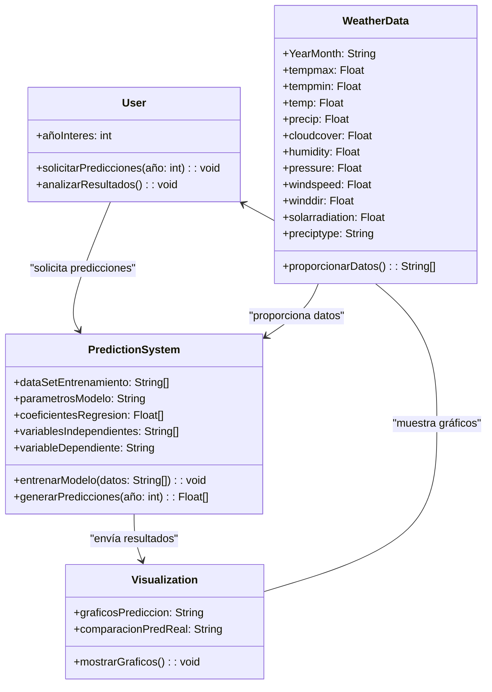

# Datos

## **Descripción de la Base de Datos de Clima - Oaxaca, México**

`DC-Ciudad_de_Oaxaca_Combianado.csv` y `DS-Ciudad_de_Oaxaca_Combianado.csv`

Esta base de datos proporciona información detallada sobre las condiciones climáticas en Oaxaca, Oaxaca, México, abarcando un rango de fechas desde el 1 de junio de 2010 hasta el 31 de junio de 2024. Los datos se recogen en unidades métricas (temperatura en grados Celsius, precipitación en milímetros, velocidad del viento en kilómetros por hora, etc.), y las coordenadas geográficas de la estación son latitud 17.0617 y longitud -96.7261.

#### **Descripción de las Variables**
Las variables principales contenidas en la base de datos son las siguientes:

- **tempmax**: Temperatura máxima en grados Celsius.
- **tempmin**: Temperatura mínima en grados Celsius.
- **temp**: Temperatura media en grados Celsius.
- **dew**: Punto de rocío en grados Celsius.
- **feelslike**: Temperatura percibida (sensación térmica) en grados Celsius.
- **precip**: Precipitación en milímetros.
- **precipprob**: Probabilidad de precipitación en porcentaje.
- **precipcover**: Cobertura de precipitación en porcentaje.
- **preciptype**: Tipo de precipitación (lluvia, nieve, etc.).
- **snow**: Cantidad de nieve caída en centímetros.
- **snowdepth**: Profundidad de la nieve en centímetros.
- **windspeed**: Velocidad del viento en kilómetros por hora.
- **windgust**: Ráfagas de viento en kilómetros por hora.
- **winddir**: Dirección del viento en grados.
- **visibility**: Visibilidad en kilómetros.
- **cloudcover**: Porcentaje de cobertura nubosa.
- **humidity**: Humedad relativa en porcentaje.
- **pressure**: Presión atmosférica al nivel del mar en milibares.
- **solarradiation**: Radiación solar en vatios por metro cuadrado.
- **solarenergy**: Energía solar recibida en megajulios por metro cuadrado.
- **uvindex**: Índice de radiación ultravioleta.
- **severerisk**: Riesgo de fenómenos severos (tormentas, huracanes, etc.).
- **sunrise**: Hora de salida del sol.
- **sunset**: Hora de puesta del sol.
- **moonphase**: Fase lunar (nueva, llena, etc.).
- **icon**: Icono representativo del clima.
- **conditions**: Texto corto describiendo el clima.
- **description**: Descripción detallada del clima del día.
- **stations**: Lista de estaciones meteorológicas que proporcionan los datos.

#### **Estructura de los Datos**
Cada registro contiene las siguientes columnas:

| datetime   | name             | tempmax | tempmin | temp | feelslikemax | feelslikemin | feelslike | dew  | humidity | precip | precipprob | precipcover | preciptype | snow | snowdepth | windgust | windspeed | winddir | sealevelpressure | cloudcover | visibility | solarradiation | solarenergy | uvindex | severerisk | sunrise             | sunset              | moonphase | conditions       | description                       | icon              | stations   |
| ---------- | ---------------- | ------- | ------- | ---- | ------------ | ------------ | --------- | ---- | -------- | ------ | ---------- | ----------- | ---------- | ---- | --------- | -------- | --------- | ------- | ---------------- | ---------- | ---------- | -------------- | ----------- | ------- | ---------- | ------------------- | ------------------- | --------- | ---------------- | --------------------------------- | ----------------- | ---------- |
| 01/06/2000 | Ciudad de Oaxaca | 27.4    | 20.2    | 24.1 | 27.2         | 20.2         | 24.1      | 13.6 | 52.6     |        | 0          | 0           | rain       |      |           |          | 7.2       | 54.3    |                  | 66         | 17.6       |                |             |         |            | 2000-06-01T06:55:51 | 2000-06-01T20:01:35 | 0.97      | Partially cloudy | Partly cloudy throughout the day. | partly-cloudy-day | 7.6773E+10 |
| 02/06/2000 | Ciudad de Oaxaca | 28.7    | 16.1    | 21.8 | 27.7         | 16.1         | 21.5      | 12.9 | 62.1     |        | 0          | 0           | rain       |      |           |          | 7.2       | 45      |                  | 46.7       | 15         |                |             |         |            | 2000-06-02T06:55:49 | 2000-06-02T20:01:56 | 0         | Partially cloudy | Partly cloudy throughout the day. | partly-cloudy-day | 7.6773E+10 |

#### **Consideraciones**
- La base de datos abarca una amplia gama de parámetros climáticos que permiten un análisis detallado de las condiciones meteorológicas a lo largo del tiempo en Oaxaca.
- La estructura de los datos incluye tanto parámetros cuantitativos (temperatura, precipitación, velocidad del viento) como cualitativos (condiciones del clima, icono, descripción).
- Los datos están organizados por fecha y estación meteorológica, lo que facilita el análisis temporal y espacial.

# Imputación de Datos

En `DS-script_imputar_datos.py`

**Imputación por Interpolación**:
- **Descripción**: Rellena los valores faltantes utilizando los valores adyacentes (ej. lineal o polinómico).
- **Ventajas**: Capta la tendencia de los datos a lo largo del tiempo.
- **Desventajas**: Puede ser engañoso si hay patrones no lineales.
- **Uso sugerido**: Cuando los datos tienen una secuencia temporal clara, como en nuestro caso.

Dado que los datos son de series temporales (días en junio de 2010 a 2014) y variables como temperatura, humedad y presión atmosférica, la **imputación por interpolación** sería una opción muy adecuada. Esto te permitiría capturar la tendencia de los datos a lo largo del tiempo y aprovechar la relación natural que tienen estos datos.

En `DC-imputar` se uso imputación para variables numéricas mediante interpolación temporal.

# Diseño Conceptual

## Entidades y Relaciones

### Entidades Principales del Sistema

Este sistema de simulación está compuesto por las siguientes entidades principales, centradas en el manejo de datos climáticos y el modelo de predicción.

#### Clima (WeatherData)
La entidad **WeatherData** representa el conjunto de datos climáticos históricos con los siguientes atributos:

- **YearMonth**: Fecha (Año y Mes)
- **tempmax**: Temperatura máxima
- **tempmin**: Temperatura mínima
- **temp**: Temperatura media
- **precip**: Precipitación
- **cloudcover**: Cobertura de nubes
- **humidity**: Humedad
- **pressure**: Presión atmosférica
- **windspeed**: Velocidad del viento
- **winddir**: Dirección del viento
- **solarradiation**: Radiación solar
- **preciptype**: Tipo de precipitación (lluvia, nieve, etc.)

#### Sistema de Predicción (PredictionSystem)
La entidad **PredictionSystem** administra el flujo de datos y ejecuta el modelo de regresión lineal múltiple para predecir la precipitación. Sus atributos incluyen:

- **DataSet de entrenamiento**: Conjunto de datos para entrenamiento del modelo.
- **Parámetros del modelo**: Configuración del modelo de predicción.
- **Coeficientes de regresión**: Pesos asignados a las variables predictoras.
- **Variables independientes**: Datos climáticos utilizados como predictores.
- **Variable dependiente**: Resultado de precipitación (predicción de precipitación).

#### Visualización (Visualization)
La entidad **Visualization** muestra los resultados de las predicciones en gráficos comparativos. Los atributos incluyen:

- **Gráficos de predicción**: Visualización gráfica de las predicciones.
- **Comparación entre predicciones y valores reales**: Muestra la precisión del modelo.

#### Usuario (User)
La entidad **User** representa a la persona que interactúa con el sistema, solicitando predicciones y analizando los resultados. Su atributo principal es:

- **Año de interés**: Año específico para el cual el usuario desea hacer predicciones.

### Variables de Estado

Las variables de estado cambian a lo largo del tiempo o durante el proceso de simulación.

- **Variables independientes (predictoras)**:
  - **tempmax**: Temperatura máxima
  - **tempmin**: Temperatura mínima
  - **humidity**: Humedad
  - **cloudcover**: Cobertura de nubes
  - **pressure**: Presión atmosférica
  - **windspeed**: Velocidad del viento
  - **solarradiation**: Radiación solar
  - **precip**: Precipitación (años anteriores)

- **Variable dependiente (predicción)**:
  - **precip**: Precipitación (variable objetivo a predecir)

### Relaciones entre Entidades

Las entidades se conectan mediante el flujo de datos y los procesos de predicción:

1. **User** solicita predicciones para un año de interés al **PredictionSystem**.
2. **WeatherData** proporciona los datos climáticos necesarios para el entrenamiento y evaluación del **PredictionSystem**.
3. **PredictionSystem** utiliza los datos y el modelo de regresión lineal múltiple para realizar las predicciones.
4. **Visualization** recibe los resultados generados, representándolos gráficamente para que **User** pueda analizar los resultados y comparar las predicciones con valores reales.

### Diagrama UML (Diagrama de Clases)

### Figura 2. Diagrama UML: Relaciones entre Entidades

#### Explicación de Entidades:

- **User**: Representa al usuario, quien solicita predicciones específicas y analiza los resultados del sistema.
- **WeatherData**: Contiene atributos climáticos históricos.
- **PredictionSystem**: Gestiona el flujo de datos y ejecuta el modelo de predicción basado en regresión lineal múltiple.
- **Visualization**: Muestra gráficamente las predicciones y permite la comparación con valores reales.

## Modelo de Regresión Lineal Múltiple para Predicción de Precipitación

### 1. Modelo Matemático Base

La regresión lineal múltiple (MLR) se puede expresar con la siguiente ecuación:

$$
\text{precip} = a_0 + a_1 \cdot \text{tempmax} + a_2 \cdot \text{tempmin} + a_3 \cdot \text{humidity} + a_4 \cdot \text{cloudcover} + a_5 \cdot \text{pressure} + a_6 \cdot \text{windspeed} + a_7 \cdot \text{solarradiation}
$$

Donde:
- `precip` = Variable dependiente (precipitación, que queremos predecir)
- `tempmax`, `tempmin`, `humidity`, `cloudcover`, `pressure`, `windspeed`, `solarradiation` = Variables independientes (predictoras)
- $a_0, a_1, a_2, \ldots, a_7$ = Coeficientes de regresión calculados a partir de datos históricos

---

### 2. Cálculo del Coeficiente de Correlación

El coeficiente de correlación $r$ indica la fuerza de la relación lineal entre cada predictor y la precipitación:

$$
r = \frac{n\sum xy - \sum x\sum y}{\sqrt{[n\sum x^2 - (\sum x)^2][n\sum y^2 - (\sum y)^2]}}
$$

---

### 3. Error de Predicción

Para evaluar la precisión de tu modelo, puedes calcular el **Error Cuadrático Medio (RMSE)**:

$$
RMSE = \sqrt{\frac{\sum_{i=1}^{n} (y_i - \hat{y_i})^2}{n}}
$$

Donde:
- $y_i$ = Valor real de precipitación
- $\hat{y_i}$ = Valor predicho de precipitación
- $n$ = Número de observaciones

---

### 4. Variables del Modelo

#### Variables Independientes (Predictoras):
1. **tempmax**: Temperatura máxima
2. **tempmin**: Temperatura mínima
3. **humidity**: Humedad
4. **cloudcover**: Cobertura de nubes
5. **pressure**: Presión atmosférica
6. **windspeed**: Velocidad del viento
7. **solarradiation**: Radiación solar (si es aplicable)
8. **precip**: Precipitación (años anteriores)

#### Variable Dependiente:
- **precip**: Precipitación (la variable que queremos predecir)

Ahora se modifica el archivo `.csv` para `DS-Datos_Climaticos_Seleccionados.csv` eliminando las columnas que no nos sean relevantes.

# Script

## Estructura
La estructura del `DS-Datos_Climaticos_Imputados.csv` ahora después de la imputación es la siguiente (contiene datos del mes de junio desde 2010 al 2024).

| datetime   | tempmax | tempmin | humidity | precip | windspeed | sealevelpressure | cloudcover | solarradiation |
| ---------- | ------- | ------- | -------- | ------ | --------- | ---------------- | ---------- | -------------- |
| 01/06/2010 | 36.2    | 14.9    | 54.8     | 0      | 22        | 1008.8           | 25.1       | 344.2          |
| 02/06/2010 | 35.1    | 14.7    | 46.4     | 0      | 22.3      | 1005.4           | 26.9       | 338            |

## Algoritmo 

**Algoritmo para Regresión Lineal Múltiple**

1. **Definir función** `RegresionLinealMultiple(MinTemp, MaxTemp, CC, VP, Y)`

2. **Recolectar datos** y guardarlos en un archivo Excel o CSV (`sample.xls`).

3. **Leer los datos** desde el archivo `sample.xls`:
   - Abrir archivo de datos `f1 = "D:\\sample.xls"`
   - Asignar cada columna de datos a las variables correspondientes:
     - `CC[j] = columna "CC"`
     - `VP[j] = columna "VP"`
     - ... (similarly para otras variables)

4. **Calcular la matriz de correlación** para todas las variables.

5. **Formar la ecuación de regresión** usando las variables independientes (`MinTemp`, `MaxTemp`, `CC`, `VP`).

6. **Obtener los coeficientes y el término constante** de la ecuación de regresión a partir de los datos.

7. **Calcular los valores predichos** (`Y_pred`) usando la ecuación de regresión y el conjunto de datos.

8. **Calcular el Error Cuadrático Medio (RMSE)** para evaluar la precisión del modelo:
   - `RMSE = raiz(media((Y_real - Y_pred)^2))`

9. **Calcular la precisión** del modelo usando una métrica de evaluación apropiada (para regresión, se usa comúnmente `R^2` en lugar de una matriz de confusión).

10. **Retornar** `RMSE` y `R^2` como métricas de evaluación del modelo.

## Scripts y Efectividad en R^2

### Siguiendo el modelo

Calculamos los datos promedios con el script `DS-script-promedio.py` a `DS-Datos_Climaticos_Promedios.csv`

Ahora con los datos crear el modelo.